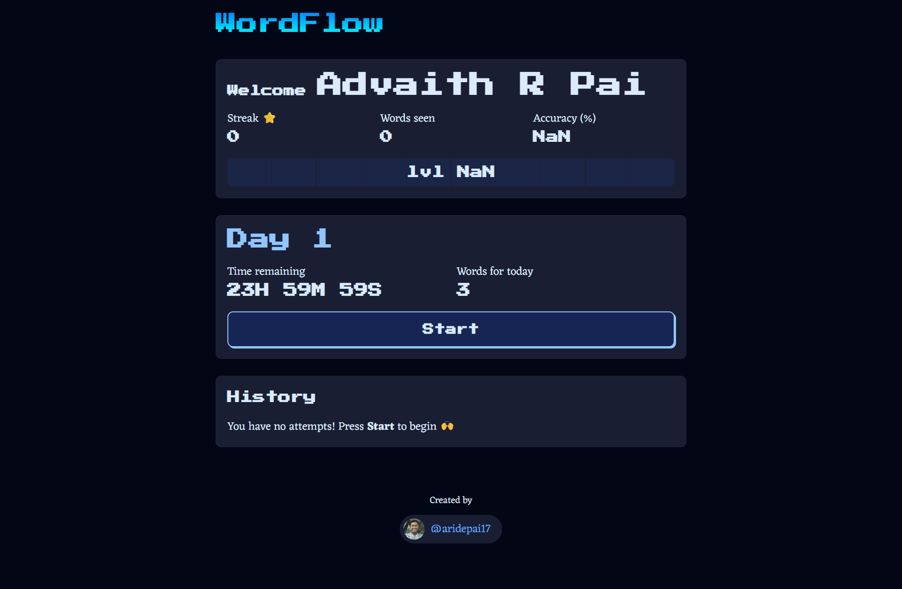
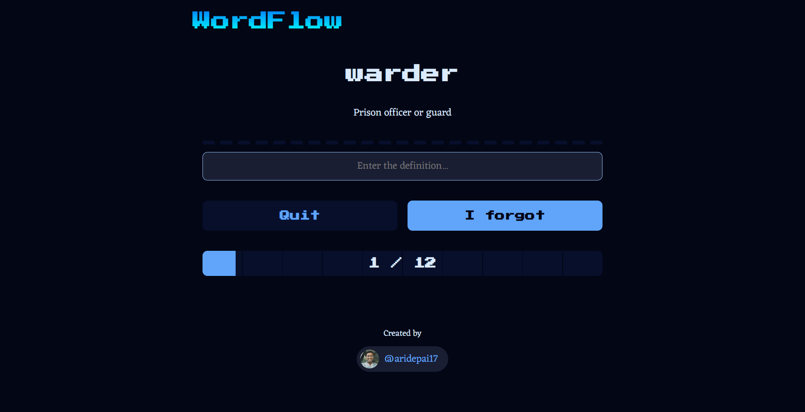

# WORDFLOW




## 📚 ABOUT

WordFlow is a minimalist and engaging web application designed to help users expand their vocabulary through daily challenges. 

Forgetting a new word days after learning it is a common struggle. WordFlow tackles this problem head-on by transforming vocabulary building into an engaging and effective daily challenge. It's built for lifelong learners, students, and anyone looking to enrich their lexicon with advanced English words. The core philosophy is simple: consistent, intelligent practice is the key to long-term memory.

The core philosophy of WordFlow is to make learning new words a simple, enjoyable, and consistent habit.

## ✨ KEY FEATURES

* **🧠 Spaced Repetition System (SRS):** The application's core is a dynamic SRS engine that generates a 365-day learning plan. It intelligently schedules word reviews at increasing intervals (e.g., 1 day, 3 days, 7 days) to lock them into your long-term memory.
* **🎮 Gamified Learning:** Stay motivated with a streak counter that resets if you miss a 24-hour cycle. Track your accuracy and watch your "level" increase as you master more words.
* **💻 Local Persistence:** All your progress—your name, current day, history, and attempts—is saved directly in your browser's `localStorage`. You can close the tab and return at any time to seamlessly pick up where you left off.
* **✍️ Interactive Practice:** The challenge interface provides live, character-by-character feedback as you type the definition, turning practice into a satisfying puzzle.
* **📊 Progress Dashboard:** A central hub to view your current streak, total words seen, overall accuracy, and a history of your past streaks.
* **🎨 Sleek & Modern UI:** A clean, responsive, and beautifully designed interface built with React and custom CSS.

## 💻 TECH STACK

This project is built with a modern frontend stack:

*   **[React](https://react.dev/):** A JavaScript library for building user interfaces.
*   **[Vite](https://vitejs.dev/):** A next-generation frontend tooling that provides a faster and leaner development experience.
*   **ESLint:** For identifying and reporting on patterns found in ECMAScript/JavaScript code.
*   **[https://www.fantacss.smoljames.com/]FantaCSS:** Custom CSS for styling the application.

## 🚀 GETTING STARTED

To get a local copy up and running, follow these simple steps.

### Prerequisites

You need to have [Node.js](https://nodejs.org/) and [npm](https://www.npmjs.com/) installed on your machine.

### Installation

1.  **Clone the repo**
    ```sh
    git clone https://github.com/your_username/wordflow.git
    ```
2.  **Navigate to the project directory**
    ```sh
    cd wordflow
    ```
3.  **Install NPM packages**
    ```sh
    npm install
    ```
4.  **Run the development server**
    ```sh
    npm run dev
    ```
    Your application should now be running on `http://localhost:5173/` (or the next available port).

## 📂 PROJECT STRUCTURE

The project follows a standard React application structure:

```
wordflow/
├── 📁 final/                  # Demo screenshots & assets
│   ├── app.png               # Main application interface
│   └── homepage.png          # Landing page preview
├── 📁 public/                # Static assets & favicon
│   └── vocab.png             # App icon/logo
├── 📁 src/
│   ├── 📁 assets/            # React & image assets
│   │   └── react.svg         # React logo
│   ├── 📁 components/        # Reusable UI components
│   │   ├── 📁 layouts/       # Page layout components
│   │   │   ├── Challenge.jsx # Daily challenge interface
│   │   │   ├── Dashboard.jsx # Main dashboard interface
│   │   │   ├── Layout.jsx    # Root layout wrapper
│   │   │   └── Welcome.jsx   # Onboarding experience
│   │   ├── Countdown.jsx     # Challenge timer component
│   │   ├── History.jsx       # Learning history display
│   │   ├── ProgressBar.jsx   # Visual progress indicators
│   │   └── Stats.jsx         # Performance analytics
│   ├── 📁 utils/             # Helper functions & data
│   │   ├── index.js          # Core utility functions & SRS logic
│   │   └── VOCAB.json        # Vocabulary database
│   ├── App.jsx               # Root application component
│   ├── fanta.css             # FantaCSS framework styles
│   ├── index.css             # Global styles & CSS variables
│   └── main.jsx              # React DOM entry point
├── .gitignore                # Git ignore rules
├── eslint.config.js          # ESLint configuration
├── index.html                # HTML template
├── package-lock.json         # Dependency lock file
├── package.json              # Dependencies & scripts
├── README.md                 # Project documentation
└── vite.config.js            # Vite build configuration
```

## 🎯 USAGE GUIDE
### Getting Started

1. Enter your name on the welcome screen to personalize your experience
2. Begin your first challenge - you'll see a word and need to type its definition
3. Receive immediate feedback as you type, with helpful hints and corrections
4. Complete your daily goal to maintain your learning streak
5. Return daily to reinforce previous words and learn new ones

<b>Pro Tips for Success</b>

1. Consistency over intensity: 10 minutes daily beats 2 hours weekly
2. Focus on accuracy: The algorithm adapts to your performance
3. Use the dashboard: Review your progress to stay motivated
4. Don't break the streak: Daily practice creates lasting habits

## 🙏 ACKNOWLEDGEMENTS

A huge thank you to the following resources which made this project possible:

*   **[React](https://react.dev/)** and **[Vite](https://vitejs.dev/)** for the incredible development experience.
*   **[FantaCSS](https://www.fantacss.smoljames.com/)** for the simple and elegant CSS styling.
*   The open-source community for providing the tools and libraries that power this application.

## 🤝 CONTRIBUTING
We welcome contributions from the community! Whether you're fixing bugs, adding features, or improving documentation, your help makes WordFlow better for everyone.
### How to Contribute

1. Fork the repository
2. Create a feature branch (git checkout -b feature/amazing-feature)
3. Commit your changes (git commit -m 'Add amazing feature')
4. Push to the branch (git push origin feature/amazing-feature)
5. Open a Pull Request

## 🌟 JOIN THE FLOW!

Find this project useful or interesting? I'd love to hear from you!

*   **Star the repo** on GitHub if you like it!
*   **Share it** with friends or colleagues who might be interested.

Happy learning!
